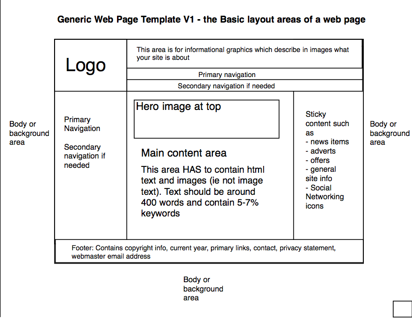

# HTML Semantic

## Learning objectives

- Use industry-standard tools (floats) to place elements on the page.

### Estimated time: 4h

## Description

HTML semantic elements are tags that provide meaning and structure to the content within a web page. They go beyond simply styling the content and help define the purpose and context of the elements. Here are some commonly used HTML semantic elements and their descriptions:

## Why are HTML Semantic important?

Using semantic elements in HTML helps improve the structure, accessibility, and search engine optimization (SEO) of web pages. They provide meaning and context to the content, making it easier for search engines to understand and index the page, as well as aiding assistive technologies in providing a better experience for users with disabilities. Additionally, semantic elements make the code more readable and maintainable, as they provide clear and logical divisions of content within the document

# HTML Semantic

| HTML tags | Description | How to used it |
|--------|----------|--------|
| `<header>`     | Represents the introductory or navigational section of a document |  It typically contains the site logo, site title, navigation menu, or other introductory content|
| `<nav>`      | Defines a section containing navigation links | It is used to create menus or lists of links that allow users to navigate to different parts of the website or different sections within the page |
| `<main>`   | Specifies the main content of a document or a specific section within it  | It should only appear once per page and should contain the core content of the document, excluding header, footer, or sidebars|
| `<article>`   | Represents a self-contained composition within a document. | Introduction to Rails(RoR), understand of MVC , Blog App Project,  API building, and deployment strategies, final project , Professional Resume|
| `<section>`   | Defines a thematic grouping of content within a document | It can be a blog post, a news article, a forum post, or any other independent piece of content that can stand alone |
| `<aside>`   | Represents content that is tangentially related to the main content  | It is commonly used for sidebars, pull quotes, or advertisements. |
| `<article>`   | Represents a self-contained composition within a document  | It can be a blog post, a news article, a forum post, or any other independent piece of content that can stand alone |
| `<footer>`   | Represents the footer section of a document or a specific section within it  | It typically contains information about the author, copyright notice, links to related documents, or other relevant details |
| `<time>`   | Represents a specific date, time, or duration | Commonly used to show datetime |
| `<address>`   | Commonly used to show datetime | It can be used for contact information such as state, city,and country
| `<em>`   | Indicates emphasized text |
| `<strong>`   | Represents important or strongly emphasized text | To mark text important |

**Note:** Y ou can have several `<header>` elements in one HTML document. However, `<header>` cannot be placed within a `<footer>`, `<address>` or another `<header>` element

### Learn more about floats

- Read this nice [guide about CSS floats](https://alistapart.com/article/css-floats-101/) by A List Apart

### Learn more about position

- First, read the documentation about [HTML Semantic](https://www.w3schools.com/html/html5_semantic_elements.asp). Make sure that you check the description of all possible values. In order to better understand **most common html tag**

- First, read the documentation about [HTML Semantic on MDN](https://developer.mozilla.org/en-US/docs/Glossary/Semantics). Make sure that you check the description of all possible values. In order to better understand
  
